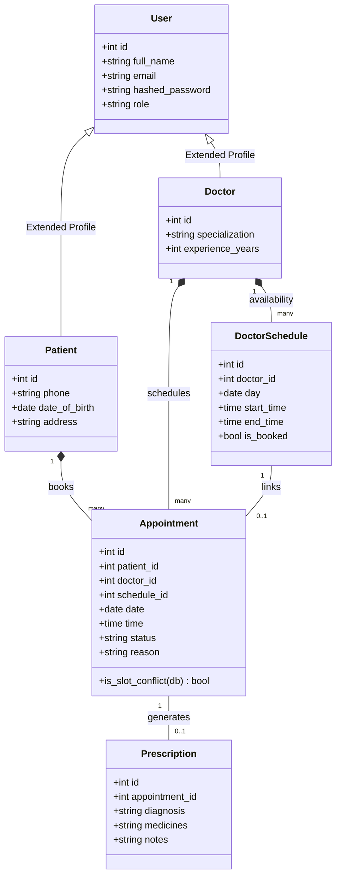

# CareFlow — Hospital Appointment System

CareFlow is a full-stack web application built to streamline operations between patients, medical specialists, and administrators. 

It provides real-time appointment scheduling, custom availability builders, complete prescription tracking, and admin analytics dashboards.

---

## Tech Stack

- **Frontend:** React (Vite) + Redux Toolkit + Tailwind CSS + React Router + Lucide Icons
- **Backend:** FastAPI (Python)
- **Database:** PostgreSQL / SQLite (via SQLAlchemy ORM)
- **Auth:** JWT token session with direct `bcrypt` password hashing

---

## Architecture & Data Model

CareFlow utilizes an OOP-based domain model system mapped through SQLAlchemy.



### Core Business Logic
The `Appointment` model implements `is_slot_conflict(db)` to enforce database-level validation checks. It prevents duplicate doctor bookings even if the client-side validation is bypassed.

---

## Features Completed

1. **Role-Based Authentication:**
   - Register/login for `patient`, `doctor`, and `admin` roles.
   - JWT sessions persisted locally (`localStorage`) to prevent logout on page refresh.

2. **Schedule Management (Doctor):**
   - Doctors can dynamically add schedule slots (date, start time, end time) and check which are booked vs open.

3. **Real-Time Booking (Patient):**
   - Patients can browse active specialists, filter by names/departments, inspect their open slots, and book appointments with custom reasons.

4. **Medical Records & Prescriptions:**
   - Doctors can confirm appointments and attach clinical diagnoses, medicines, and consultation notes.
   - Attaching a prescription automatically marks the appointment as `completed`.
   - Patients can view their complete medical prescription history from past consultations.

5. **Admin Operations Dashboard:**
   - Visual analytics metrics (total patients, doctors, pending confirmations).
   - User Directory listing all registered users with detailed profiles.
   - Master Appointments Ledger providing administrators with system-wide cancel/confirm overrides.

---

## Getting Started

### Local Setup

#### Prerequisites
- Python 3.10+
- Node.js 18+

#### 1. Backend Server Setup
```bash
cd backend
# Create virtual environment
python -m venv venv
# Activate virtual environment
# On Windows:
venv\Scripts\activate
# On Linux/macOS:
source venv/bin/activate

# Install dependencies
pip install -r requirements.txt

# Run the backend
python -m uvicorn app.main:app --host 127.0.0.1 --port 8000
```
Swagger documentation will be available at: `http://127.0.0.1:8000/docs`

#### 2. Frontend Server Setup
```bash
cd frontend
# Install packages
npm install

# Start Vite server
npm run dev
```
Open your browser at: `http://localhost:5173`

---

## Verification & Testing
CareFlow includes automated test suites to ensure model logic and end-to-end API operations function correctly.

Run the unit tests:
```bash
python backend/test_api.py
```

Run the end-to-end integration test:
```bash
python backend/test_integration.py
```
